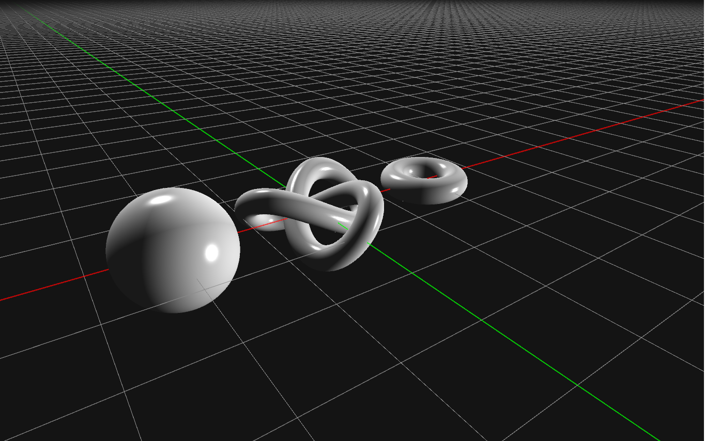

## My first openGL project, using glfw, glew and glm

## Features

* Renders 3 shapes: sphere, torus and trefoil knot
* shading method  : phong shading
* implements a basic viewport camera that uses WASD and mouse for navigation

## Build it yourself

##### Change your include and library path to the directories that contain glfw, glew and glm

## [GLFW](https://www.glfw.org/)
## [GLEW](http://glew.sourceforge.net/)
## [GLM](https://github.com/g-truc/glm)

## Screenshots

